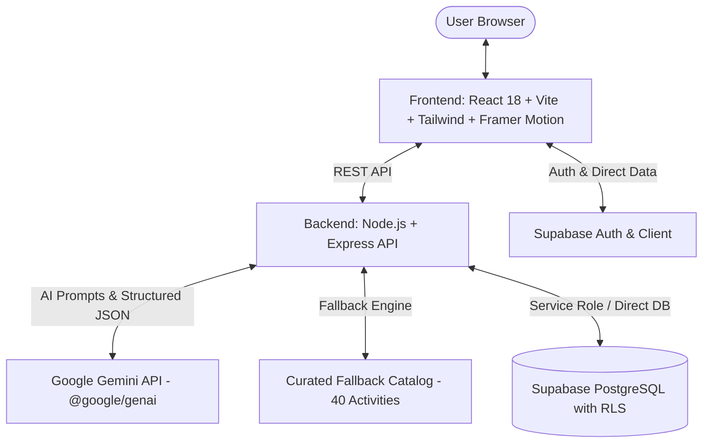

# VIBECRAFT AI ⚡

> **Turn awkward silence into meaningful connection.**  
> A production-quality generative AI icebreaker, team-building activity, and trivia generator for modern team leads, facilitators, HR managers, educators, and event organizers.

[](https://react.dev/)
[](https://vitejs.dev/)
[](https://tailwindcss.com/)
[](https://nodejs.org/)
[](https://aistudio.google.com/)
[](https://supabase.com/)

---

## 🌟 Table of Contents
1. [Project Overview](#project-overview)
2. [Key Features](#key-features)
3. [Technology Stack & Architecture](#technology-stack--architecture)
4. [Folder Structure](#folder-structure)
5. [Quick Start (Zero-Configuration Ready)](#quick-start-zero-configuration-ready)
6. [API Keys & Environment Setup (Where to Add Keys)](#api-keys--environment-setup)
7. [Database Setup (Supabase PostgreSQL & RLS)](#database-setup-supabase-postgresql--rls)
8. [Google Gemini AI Setup](#google-gemini-ai-setup)
9. [Interactive Features Walkthrough](#interactive-features-walkthrough)
10. [Deployment Guide](#deployment-guide)
11. [Troubleshooting & Verification](#troubleshooting--verification)

---

## 1. Project Overview

**VIBECRAFT AI** is designed to eliminate meeting fatigue, disengaged team calls, and awkward silence. By leveraging **Google Gemini AI** and psychological safety principles, it creates targeted activities based on team size, physical setting (Remote, In-person, Hybrid), desired vibe (Casual, Professional, Energetic, Creative, Relaxed), and time constraints.

### 🛡️ Built-in Resilience
- **Offline & Zero-Key Fallback**: The app operates with **40+ curated production activities** if the Gemini API key is missing or rate-limited.
- **Hybrid Persistence**: Supabase PostgreSQL cloud database with full Row-Level Security (RLS) policies, alongside a local development store for immediate evaluation.
- **Security-First Architecture**: Service-role keys and backend secrets never leak to the client bundle.

---

## 2. Key Features

- **⚡ Dynamic Activity Generator**: Multi-selector for team size (`2-5` to `50+`), setting (`Remote`, `In-person`, `Hybrid`), vibe, and duration, generating 3–5 tailored activities.
- **🎲 Surprise Me**: Randomizer with playful dice animation for when teams want serendipitous fun without decision fatigue.
- **▶ Facilitation Play Mode**: Full interactive facilitator dashboard featuring an active countdown timer, audio chime, step-by-step progress tracking, materials checklist, and celebratory confetti.
- **↻ Intelligent Regeneration**: Replaces any specific activity card while preventing repetition using prompt exclusions.
- **❤️ Vault / Favorites**: Persistent saved activities with real-time search, multi-filter by vibe/setting, and sorting.
- **📜 Generation History**: Comprehensive audit log of past batches, allowing 1-click re-opening and history clearing.
- **👥 Saved Team Profiles**: Store recurring teams (e.g. *"Growth Marketing Squad"* or *"Engineering All-Hands"*) and auto-populate the generator with one click.
- **🧠 Team Vibe Quiz**: 5-question team assessment diagnosing collective personality archetype (e.g., *"The Out-of-the-Box Innovators"*) and recommending matching activities.
- **🎯 Trivia Arena**: High-energy 5-round trivia game featuring sound effects, instant feedback, streak multipliers, and leaderboard scoring.
- **📤 Multi-Channel Sharing & Export**: Copy shareable links, formatted Markdown meeting agendas, native system share menu, and clean print/PDF export.

---

## 3. Technology Stack & Architecture



- **Frontend**: React 18, Vite, Tailwind CSS, Framer Motion, Lucide React icons, Canvas Confetti, Web Audio API.
- **Backend**: Node.js (ES Modules), Express.js, CORS, Dotenv.
- **AI SDK**: `@google/genai` (official latest Google GenAI SDK) running `gemini-2.5-flash` with strict JSON schema outputs.
- **Database**: Supabase PostgreSQL with Row Level Security (RLS), cascading foreign keys, performance indexes, and auth triggers.

---

## 4. Folder Structure

```
vibecraft-ai/
│
├── backend/
│   ├── controllers/         # Express route controllers
│   │   ├── activityController.js
│   │   ├── favoritesController.js
│   │   ├── historyController.js
│   │   ├── teamsController.js
│   │   ├── quizController.js
│   │   └── triviaController.js
│   ├── routes/              # Modular Express routers
│   ├── services/            # AI, Supabase & Fallback services
│   │   ├── aiService.js     # Google GenAI integration & JSON parser
│   │   ├── fallbackService.js # 40-item fallback engine & trivia
│   │   └── supabaseService.js # Database operations & dev store
│   ├── middleware/          # Auth JWT verification & error handler
│   ├── data/                # Curated activities dataset
│   ├── test/                # Automated backend test suite
│   ├── server.js            # Main backend server entrypoint
│   ├── package.json
│   └── .env.example
│
├── frontend/
│   ├── src/
│   │   ├── components/      # UI components (Generator, Card, PlayMode, etc.)
│   │   ├── pages/           # Favorites, History, Explore views
│   │   ├── context/         # AuthContext & ToastContext
│   │   ├── services/        # Frontend API client
│   │   ├── lib/             # Supabase client setup
│   │   ├── utils/           # Audio effects (Web Audio API)
│   │   ├── App.jsx          # Root view router & state
│   │   ├── index.css        # Tailwind & print styles
│   │   └── main.jsx
│   ├── index.html
│   ├── vite.config.js
│   ├── tailwind.config.js
│   ├── package.json
│   └── .env.example
│
├── supabase/
│   ├── schema.sql           # Complete DDL tables, indexes, RLS & triggers
│   └── seed.sql             # 40 production activities seed data
│
├── README.md
└── .gitignore
```

---

## 5. Quick Start (Zero-Configuration Ready)

The application is pre-configured so you can run and test all features immediately:

### Step 1: Start Backend
```bash
cd backend
npm install
npm start
```
*The backend starts at `http://localhost:5000` with the curated fallback engine active.*

### Step 2: Start Frontend
In a new terminal window:
```bash
cd frontend
npm install
npm run dev
```
*The frontend opens at `http://localhost:5173`.*

---

## 6. API Keys & Environment Setup

> [!IMPORTANT]
> ### 📍 WHERE TO ENTER YOUR API KEYS:
> - **Backend API Keys**: Open `backend/.env` (created from `backend/.env.example`).
> - **Frontend Supabase Keys**: Open `frontend/.env` (created from `frontend/.env.example`).

### 1. Backend Configuration: `backend/.env`
```env
PORT=5000
CLIENT_URL=http://localhost:5173

# Paste your Gemini API Key below (from https://aistudio.google.com/app/apikey)
GEMINI_API_KEY=AIzaSy...

# Paste your Supabase Project URL & Anon Key (from Project Settings -> API)
SUPABASE_URL=https://your-project.supabase.co
SUPABASE_ANON_KEY=eyJhbGciOi...

# Server-side only: Supabase service role key (OPTIONAL)
SUPABASE_SERVICE_ROLE_KEY=
```

### 2. Frontend Configuration: `frontend/.env`
```env
# Backend API URL
VITE_API_URL=http://localhost:5000/api

# Public Supabase credentials (safe for browser)
VITE_SUPABASE_URL=https://your-project.supabase.co
VITE_SUPABASE_ANON_KEY=eyJhbGciOi...
```

---

## 7. Database Setup (Supabase PostgreSQL & RLS)

1. Create a free project at [supabase.com](https://supabase.com).
2. Go to the **SQL Editor** in your Supabase dashboard.
3. Open `supabase/schema.sql` from this repository, copy its contents, and click **Run**.
4. Open `supabase/seed.sql`, copy its contents, and click **Run** to load 40 curated starter activities.
5. In **Project Settings** -> **API**, copy your `URL` and `anon/public` key into `backend/.env` and `frontend/.env`.

### Schema Highlights
- `profiles`: Extends `auth.users` with display name and avatar (auto-synced via trigger).
- `activities`: Stores activities with `team_size_min/max`, `setting`, `vibe`, `instructions` (JSONB), `materials` (JSONB), and `why_it_works`.
- `favorites`: Unique user-activity pairing with foreign key cascade.
- `generation_history`: Logs prompt parameters and generated suggestions per user.
- `teams`: Saved team rosters for instant generator auto-fill.
- `quiz_results`: Stores Team Vibe Quiz diagnostics.
- **Row Level Security (RLS)**: Enforced across all tables—users can strictly only access their own private data, while curated activities are readable by all.

---

## 8. Google Gemini AI Setup

1. Obtain a free API key from [Google AI Studio](https://aistudio.google.com/app/apikey).
2. Paste it into `backend/.env`:
   ```env
   GEMINI_API_KEY=AIzaSy...
   ```
3. Restart the backend: `npm start`.
4. The terminal will output:
   `✨ [AI] Gemini API Key detected. Live Generative AI is ACTIVE.`

---

## 9. Interactive Features Walkthrough

### 1. 2-Minute Judging Demo Flow
1. **Open the App**: Visit `http://localhost:5173`.
2. **Select a Demo Scenario**: Click *"Monday Morning Sync"* in the hero section to automatically pre-fill the form with 6-10 people, Hybrid setting, and Casual vibe.
3. **Generate Activities**: Click **Generate Activities** to see 4 suggestions with difficulty badges, duration, and *Why It Works* explanations.
4. **Try Surprise Me**: Click **🎲 Surprise Me** in the top bar to roll the serendiptous dice.
5. **Start Facilitation Play Mode**: Click **▶ Start Activity** on any card. Experiment with the live countdown timer, audio chime, check off instructions, and click **Complete Activity** for celebration confetti.
6. **Save to Favorites**: Click the ❤️ button to save an activity, then open the **Favorites** tab to search and filter your vault.
7. **Take the Team Vibe Quiz**: Open **Vibe Quiz** and answer 5 questions to receive your team archetype and tailored recommendations.
8. **Play Trivia Arena**: Open **Trivia Arena** to test your knowledge with sound effects and streak tracking.

---

## 10. Deployment Guide

### Deploying Frontend (Vercel / Netlify)
1. Push your repository to GitHub.
2. Link the repository to Vercel or Netlify.
3. Set **Root Directory** to `frontend`.
4. Set build command: `npm run build` and output directory: `dist`.
5. Add environment variables:
   - `VITE_API_URL`: Your deployed backend URL (e.g. `https://vibecraft-api.onrender.com/api`)
   - `VITE_SUPABASE_URL`: Your Supabase URL
   - `VITE_SUPABASE_ANON_KEY`: Your Supabase Anon Key

### Deploying Backend (Render / Railway)
1. Set **Root Directory** to `backend`.
2. Set start command: `node server.js`.
3. Add environment variables in Render/Railway dashboard:
   - `PORT`: `5000`
   - `CLIENT_URL`: Your deployed frontend URL
   - `GEMINI_API_KEY`: Your Gemini API key
   - `SUPABASE_URL`: Your Supabase URL
   - `SUPABASE_ANON_KEY`: Your Supabase Anon Key

---

## 11. Troubleshooting & Verification

- **Running Backend Automated Tests**:
  ```bash
  cd backend
  npm test
  ```
- **Checking System Diagnostics**:
  Visit `http://localhost:5000/api/health` to view the live JSON status of the AI engine and database.
- **Port Conflicts**:
  If port 5000 is occupied, set `PORT=5001` in `backend/.env` and update `VITE_API_URL=http://localhost:5001/api` in `frontend/.env`.

---

*Crafted for teams everywhere by VibeCraft AI.*
